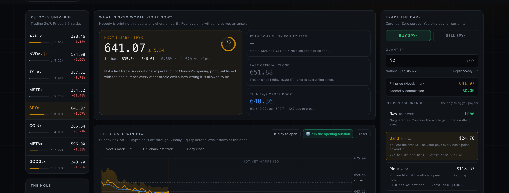
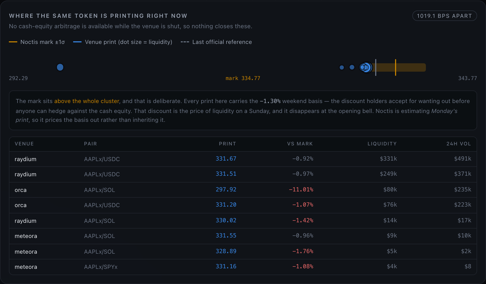
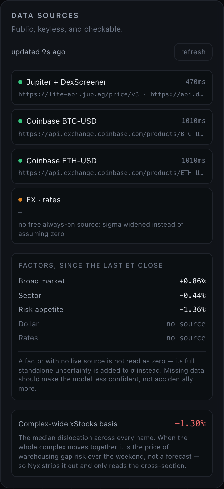
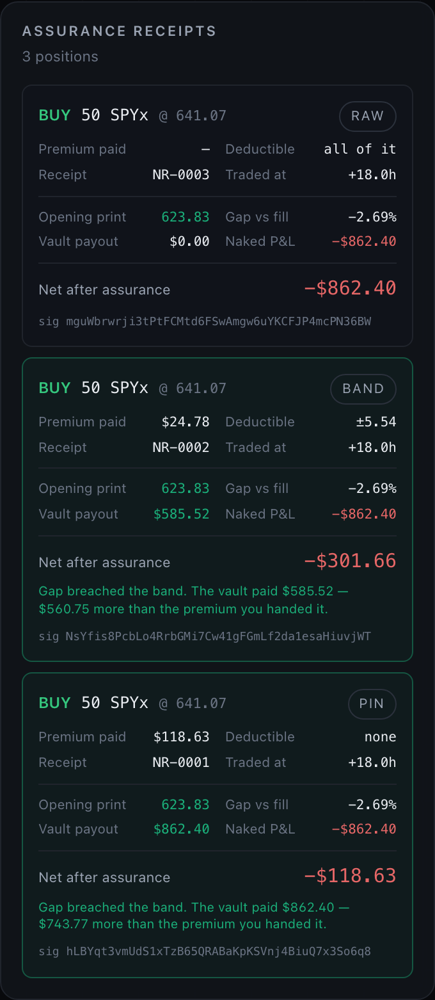
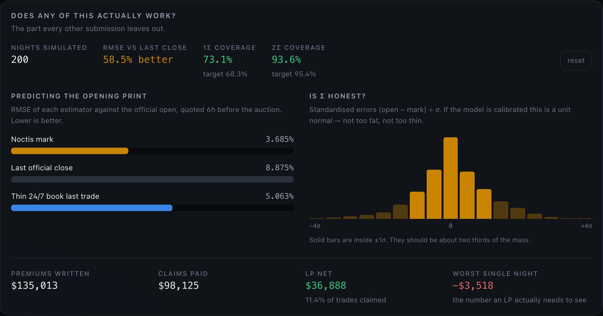

<h1>Noctis</h1>

**Fair value, and a price for being wrong about it, during the 135 hours a week nobody is printing US equities.**

Stocklana hackathon submission · Solana Foundation · September 2026



---

## The hole

A week has 168 hours. US equities discover a price in **32.5** of them.

xStocks and every other tokenized-equity program on Solana trade all 168. So for
four fifths of the week, an asset changes hands at a price that no venue anywhere
on earth is producing. Ask the infrastructure what AAPLx is worth at 03:00 on a
Sunday and you get one of three bad answers:

| | answer | why it's bad |
|---|---|---|
| Pyth / Chainlink equity feed | `MARKET_CLOSED` | honest, and useless — there is no executable price |
| Last official close | Friday's number | ignores everything that has happened since |
| The 24/7 order book | last trade | one $40k order, 26–60 bps to cross, no arb available to pull it back |

Pyth Pro now covers pre-market through overnight — **24/5**. That is real progress
and it closes most of the weekday hole. It does not cover the **65.5-hour weekend**,
which is 39% of the week, and it does not cover holidays.

That gap is what Noctis is for.

## Live, on mainnet, right now

The demo has two modes and the toggle is in the header. **Live** points the same
model at real data — Jupiter for on-chain and reference prices, DexScreener for
volume and per-venue prints, Coinbase for crypto returns measured from the actual
last ET close. Public endpoints, no API key, no server, fetched straight from the
browser.

Here is what it found on a Sunday night. Eight live AAPLx pools, same token, same
instant, real money in each:



**1019 basis points** between the highest and lowest print. Nobody can arbitrage
that away, because the thing you would hedge against is shut. "The on-chain price"
is not one number.

Pointing the code at mainnet also changed the model twice — see
[docs/DATA.md](docs/DATA.md):

- **The weekend basis is not a forecast.** Every xStock trades below its reference
  at once on a Sunday. Read naively that says the market is about to gap down 1.3%;
  really it is the price of liquidity when nobody can hedge. Nyx strips the median
  dislocation out and reads only the cross-section.
- **Factors are built leave-one-out.** SPYx *is* the market proxy, so letting it
  help build the factor that then explains it was counting one observation twice
  and giving it a 0.44% σ it had not earned.

And where a factor has no free always-on source — a dollar index, a tokenised-bill
yield — it is reported as **no source** and σ widens by the full uncertainty of the
move it would have explained. Setting it to zero would be a confident claim that
the dollar has not moved. Missing data should make the model less confident, not
accidentally more.



Live mode **cannot verify itself** — scoring a mark needs an opening print, and
Monday hasn't happened. So: live data proves the inputs are real, and the
synthetic backtest below proves the model is calibrated. Neither claim borrows the
other's evidence.

## What Noctis does

**1. It publishes a mark, with the number every other oracle omits.**

Nyx — the fair-value engine — fuses two independent, noisy witnesses to the
latent value of a tokenized equity:

- a **factor model** over signals that never sleep (broad market, sector, crypto
  risk appetite, the dollar, rates), and
- the **on-chain tape** itself, weighted by how much money actually stood behind it.

It combines them by precision, which is why it beats both of its own inputs, and
it publishes the posterior standard deviation **σ** alongside the mid. Not
decoration — σ is the product.

**2. It sells certainty about the reopening print, and nothing else.**

You are filled at the mark. Zero spread. Zero commission. Zero bps of anything.

The only money you can spend is on a guarantee about the opening auction:

| tier | deductible | you get |
|---|---|---|
| **Raw** | everything | nothing, forever free |
| **Band** | first 1σ | the vault pays every basis point beyond it |
| **Pin** | none | you are made whole to the official opening print |

Three identical trades into the same Sunday sell-off, from the live demo:

| | premium | vault paid | net |
|---|---|---|---|
| Raw | — | $0.00 | **−$862.40** |
| Band | $24.78 | $585.52 | **−$301.66** |
| Pin | $118.63 | $862.40 | **−$118.63** |

The Pin holder's entire loss is the premium. That is what the product is.



**3. It gets paid only when it is right.**

Every dollar of premium goes to the underwriting vault. The protocol takes **10%
of the vault's net profit** and nothing at all on your volume. Mis-estimate σ and
the vault loses money and Noctis earns zero. There is no order-flow revenue to
hide behind. The incentive to be calibrated *is* the business model.

## Does it work?

Every hackathon demo asserts this. `engine/backtest.ts` measures it — 800
independent synthetic weekends and overnights across 8 names, with Nyx blind to
the latent path it is scored against.

```
$ npx tsx engine/backtest.ts 800 BAND

  Predicting the official opening print (RMSE, lower is better)
    Noctis mark                   3.580%  ██████████████
    Last official close           8.473%  ██████████████████████████████████
    Thin 24/7 book last trade     5.008%  ████████████████████
                                          → Noctis is 57.7% better than doing nothing

  Is sigma honest?
    inside ±1σ     73.5%   (a calibrated model gives 68.3%)
    inside ±2σ     94.2%   (a calibrated model gives 95.4%)

  Underwriting book
    premiums written       $539,724
    claims paid            $373,641   (12.5% of trades claimed)
    LP net                 $166,083
    worst single night      $-5,020
    loss ratio                0.692
```

Read honestly: the point estimate beats both baselines, σ runs slightly **wide**
at 1σ and lands on target at 2σ, and the book runs at a 0.69 loss ratio — LP
margin, and users paying a little more than fair for Band. Those are the real
numbers and they are in the UI too, one click.



## Run it

```bash
# the demo — both modes, toggle in the header
cd app && npm install && npm run dev        # http://localhost:5273

# the numbers
npx tsx engine/backtest.ts 800 BAND

# the program: fixed-point premium math
cargo test -p noctis --lib

# the program: full lifecycle on a real validator
./scripts/localnet-test.sh
```

`./scripts/localnet-test.sh` boots a throwaway validator, deploys the SBF binary
and runs the whole lifecycle — register → publish mark → LP underwrites → RAW fill
(free) → Pin fill (premium charged, matched against the on-chain fixed-point math)
→ opening auction → settle → payout → capital released.

```
  ✓ initialises with a profit-share, not a volume fee
  ✓ registers an asset at its Friday close
  ✓ refuses to quote when uncertainty is absurd
  ✓ publishes a weekend mark with its uncertainty attached
  ✓ lets an LP underwrite the gap
  ✓ charges nothing for a RAW fill
  ✓ two fee-free trades do not collide on the receipt PDA
  ✓ prices Pin cover as an option on the gap, and charges exactly that
  ✓ honours the caller premium limit
  ✓ will not settle before the auction has printed
  ✓ makes a Pin holder whole when Monday gaps against them
  ✓ will not settle the same receipt twice
  ✓ leaves the LP down exactly premiums minus claims
  ✓ refuses to let an LP withdraw capital that is backing live receipts
  ✓ refuses to trade against a stale mark

  15 passing, 0 failing
```

## Layout

```
programs/noctis/       Anchor program  ·  program id NoCTajFqJn1QScfX3KozwSitGzcVf6muHLKXoKQhbhE
  src/math.rs          fixed-point premium & settlement, 12 unit tests, no floats
  src/lib.rs           marks, vault, receipts, permissionless settlement crank
app/                   the demo (Vite + React, hand-rolled SVG charts)
  src/lib/nyx.ts       the fair-value engine
  src/lib/feeds.ts     live mainnet data — Jupiter, DexScreener, Coinbase
  src/lib/useLive.ts   live mode: same model, real inputs
  src/lib/pricing.ts   the premium math, mirrored by math.rs
  src/lib/world.ts     deterministic synthetic world with a latent truth Nyx cannot see
  src/lib/backtest.ts  scoring
engine/backtest.ts     the same backtest as a CLI
tests/noctis.ts        on-chain lifecycle suite
scripts/               localnet runner, screenshots, demo recorder
docs/                  MODEL · PRICING · WHY_SOLANA · DEMO · SUBMISSION
```

## Docs

- [docs/DATA.md](docs/DATA.md) — the live feeds, and the two things real data forced into the model
- [docs/MODEL.md](docs/MODEL.md) — how the mark and σ are built, and what σ is made of
- [docs/PRICING.md](docs/PRICING.md) — the premium as an option on the gap, and a load we tested and deleted
- [docs/WHY_SOLANA.md](docs/WHY_SOLANA.md) — why this is not a web2 API with a token bolted on
- [docs/DEMO.md](docs/DEMO.md) — the three-minute walkthrough
- [docs/LIMITS.md](docs/LIMITS.md) — what is synthetic, what is unsolved, what would break first

## Honesty

**Live mode** is real mainnet data from public keyless endpoints, listed with
status and latency in the UI so you can check every one.

**Simulation mode** is synthetic and deterministic — one seed, reproducible, and
documented in [docs/LIMITS.md](docs/LIMITS.md). Betas, vols and the latent path
are calibrated to plausible values, not fetched. Every calibration number in this
README comes from there, because scoring a mark requires an opening print that
live mode does not have yet.

Also real: the program compiles to SBF and passes a full lifecycle on a validator,
and the fixed-point premium math is the same formula in Rust and TypeScript, with
the on-chain test asserting the client's number against the chain's.

Nothing here is investment advice, and Reopen Assurance is a mechanism prototype,
not a regulated insurance product.
